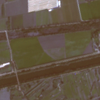
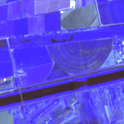
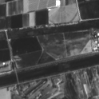
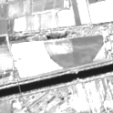
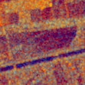
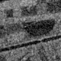
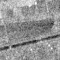
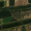
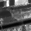
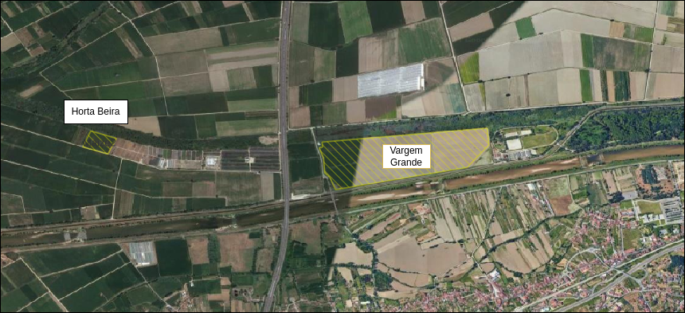

# EarthCapture_Timelapse
With a given list of regions of interst it retives all available images in a set timeframe. The available colections are [Sentinel-1](https://developers.google.com/earth-engine/datasets/catalog/COPERNICUS_S1_GRD), [Sentinel-2](https://developers.google.com/earth-engine/datasets/catalog/COPERNICUS_S2_SR_HARMONIZED) and [Landsat-8](https://developers.google.com/earth-engine/datasets/catalog/LANDSAT_LC08_C02_T1_L2), [Landsat-9](https://developers.google.com/earth-engine/datasets/catalog/LANDSAT_LC09_C02_T1_L2).

## Description
Taking as an input one or more KML files, extracts the Regions of Interest(ROI), those ROI having the any given shape or size. Those regions are then centered in the choosen window and new Areas are created. Based on the picked colections a request is made to earth engine of all images of those areas in the given timeframe. A mask of the ROI in the created window is created for each Region of the KMLs.

## Setup
1. Install dependencies
```sh
pip install -r requirements.txt
```
2. Authenticate with Google Earth Engine:<br>
   Copy your ee-authfile.json and service_account.json to your project files.
   [Tutorial - GEE Authentication Using API Key (Service Account)](https://www.youtube.com/watch?v=wHBUNDTvgtk)
3. Kml file (Multiple regions on the same KML file or in separeted files):<br>
   Create your kml file
   [Tutorial - KML google maps export](https://www.youtube.com/watch?v=LQz3kUMKMwU)

## Results Structure
```
results/  
 ├── region_name_0/             # Folder for a specific region  
 │   ├── mask/                  # Mask images
 │   │   ├── mask.png
 │   ├── landsat/               # Landsat images
 │   │   ├── landsat-8/         # landsat-8 images
 │   │   │   ├── (...)          # Bands Folders  
 │   │   ├── landsat-9/         # landsat-9 images  
 │   │   │   ├── RGB/           # True color images  
 │   │   │   ├── CIR/           # Color Infrared (CIR) images  
 │   │   │   ├── RGA/           # Custom RGA composite images  
 │   │   │   ├── B1/            # Single band images (e.g., Band 1)  
 │   │   │   │   ├── img1.png  
 │   │   │   │   ├── img2.png  
 │   │   │   │   └── img3.png
 │   ├── sentinel/              # Sentinel folder  
 │   │   ├── sentinel-1/        # Sentinel-1 images
 │   │   │   ├── (...)          # Bands Folders  
 │   │   ├── sentinel-2/        # Sentinel-2 images  
 │   │   │   ├── RGB/           # True color images  
 │   │   │   ├── CIR/           # Color Infrared (CIR) images  
 │   │   │   ├── RGA/           # Custom RGA composite images  
 │   │   │   ├── B1/            # Single band images (e.g., Band 1)  
 │   │   │   │   ├── img1.png  
 │   │   │   │   ├── img2.png  
 │   │   │   │   └── img3.png
 ├── region_name_1/             # Folder for a specific region
 │   ├── (...) 
```

## Usage

```sh
python EE_Image_Request.py --satelites "ALL" --window_size 124 --start_date "2025-01-07" --end_date "2025-07-15"
```

## Results Preview

Sentinel-2

   

Sentinel-1 

  

Landsat 

   

## Maize Fields
Regions of interest in this project.


